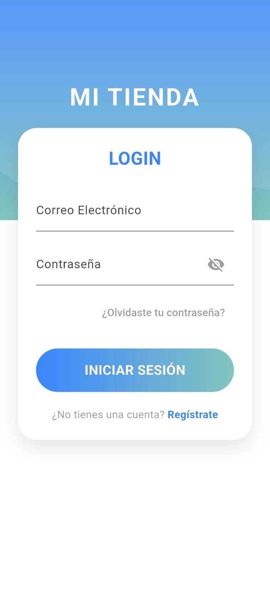
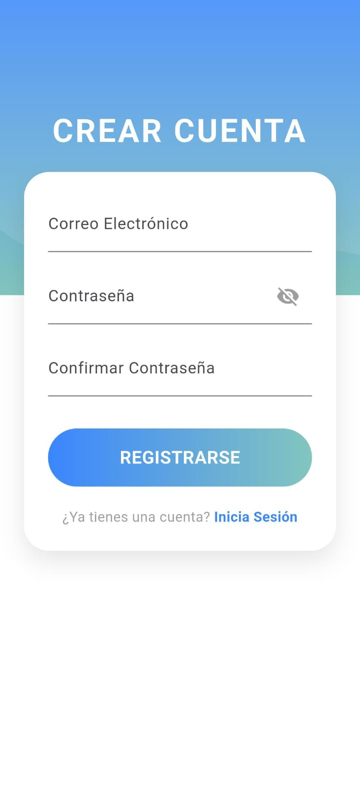
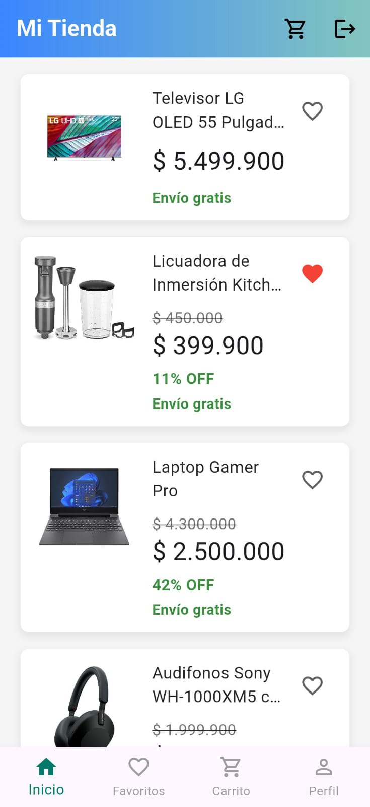
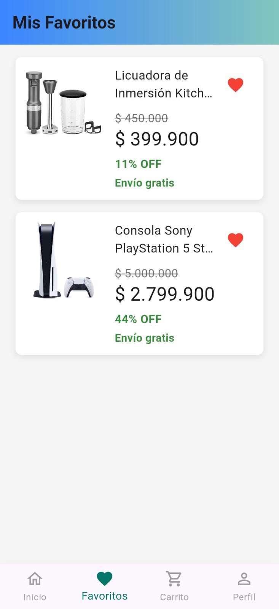
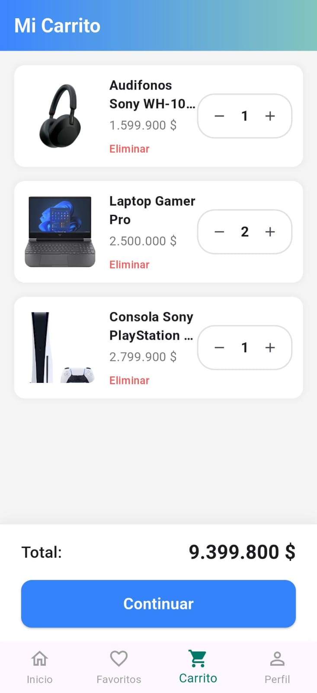
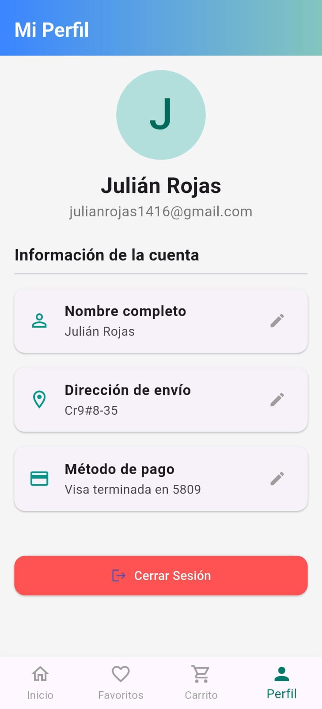

# 🛒 Mi Tienda
Aplicación desarrollada en **Flutter** con integración de **Firebase**.

---

## 🚀 Tecnologías
- Flutter
- Dart
- Firebase Authentication
- Cloud Firestore

---

## 🔍 Características
✔ Registro e inicio de sesión  
✔ Lista de productos  
✔ Favoritos  
✔ Carrito de compras  
✔ Perfil de usuario  

---

## 🖼 Capturas de pantalla

<p align="center">
  
  
  
</p>

<p align="center">
  
  
  
</p>

---

## 🛠 Instalación
1. Clona el repositorio:
   ```bash
   git clone https://github.com/julian1416/Tienda.git
