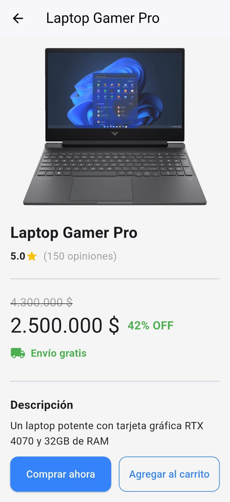
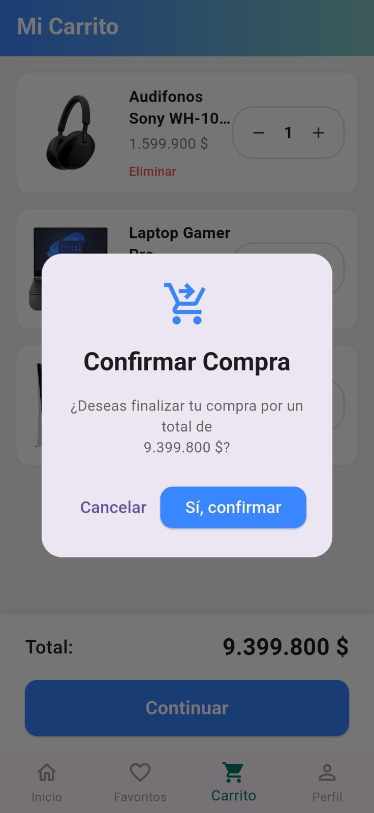

# 🛒 Mi Tienda

[](https://flutter.dev)
[](https://dart.dev)
[](https://firebase.google.com/)
[](#-licencia)
[]()

**Mi Tienda** es una aplicación móvil de **e-commerce** desarrollada con **Flutter** y **Firebase**.  
Permite a los usuarios explorar productos, ver descuentos, marcarlos como favoritos, añadirlos al carrito y gestionar su perfil.  
El objetivo es ofrecer una **experiencia de compra moderna y fluida**, inspirada en plataformas como Mercado Libre.

> **Autor:** Julián Rojas

---

## ✨ Características

- 🔐 **Autenticación de usuarios** con Firebase Authentication (registro e inicio de sesión).
- 📦 **Catálogo de productos dinámico** desde **Cloud Firestore** en tiempo real.
- ❤️ **Favoritos por usuario** (persistentes en Firestore).
- 🛒 **Carrito de compras** con cantidades, actualización y “checkout” simulado.
- 👤 **Perfil de usuario** con edición de nombre, dirección y método de pago.
- 💵 **Precios y descuentos** con formateo local (`intl`) y porcentaje de ahorro.
- ⚡ **UI responsiva** y **carga de imágenes cacheada** (`cached_network_image`).

---

## 🧱 Stack Tecnológico

- **Framework:** Flutter (Dart)
- **Backend/BBDD:** Firebase  
  - Authentication  
  - Cloud Firestore  
- **Gestión de estado:** `setState` (simple y directa en esta versión)
- **Paquetes clave:**
  - `firebase_core`, `cloud_firestore` — integración con Firebase
  - `firebase_auth` — autenticación
  - `cached_network_image` — imágenes optimizadas con cache
  - `intl` — formateo de moneda (ej. `es_CO`)

---

## 🗂️ Estructura del proyecto (resumen)

mi_tienda/
├─ lib/
│  ├─ main.dart
│  ├─ firebase_options.dart # (NO se sube; se genera con FlutterFire)
│  ├─ models/
│  │  └─ product_model.dart
│  ├─ screens/
│  │  ├─ auth_wrapper.dart
│  │  ├─ home_screen.dart
│  │  ├─ profile_screen.dart
│  │  ├─ register_screen.dart
│  │  └─ product_detail_screen.dart
│  ├─ services/
│  │  ├─ auth_service.dart
│  │  └─ firestore_service.dart
│  └─ widgets/
│     └─ product_card.dart
├─ screens/ # Capturas para el README
│  ├─ login.jpg
│  ├─ create.jpg
│  ├─ homepage.jpg
│  ├─ favorites.jpg
│  ├─ shopping.jpg
│  ├─ profile.jpg
│  ├─ description.jpg
│  └─ confirmation.jpg
├─ android/ ... / ios/ ... # Proyectos nativos
├─ pubspec.yaml
└─ README.md

---

## 🖼️ Capturas

<p align="center">
  
  
  
</p>

<p align="center">
  
  
  
</p>

<p align="center">
  
  
</p>

---

## 🚀 Cómo ejecutar el proyecto

### 1) Clonar e instalar dependencias
```bash
git clone https://github.com/julian1416/Tienda.git
cd Tienda
flutter pub get
